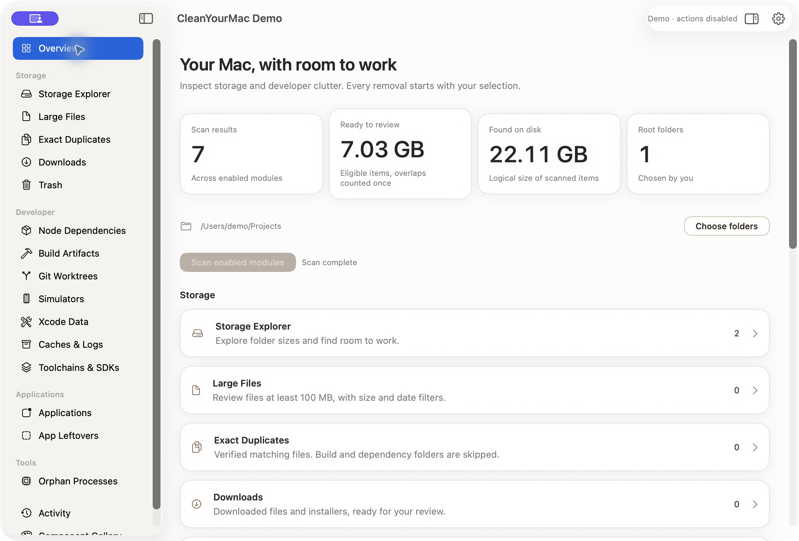
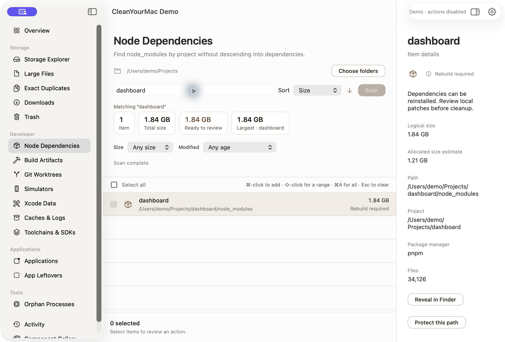
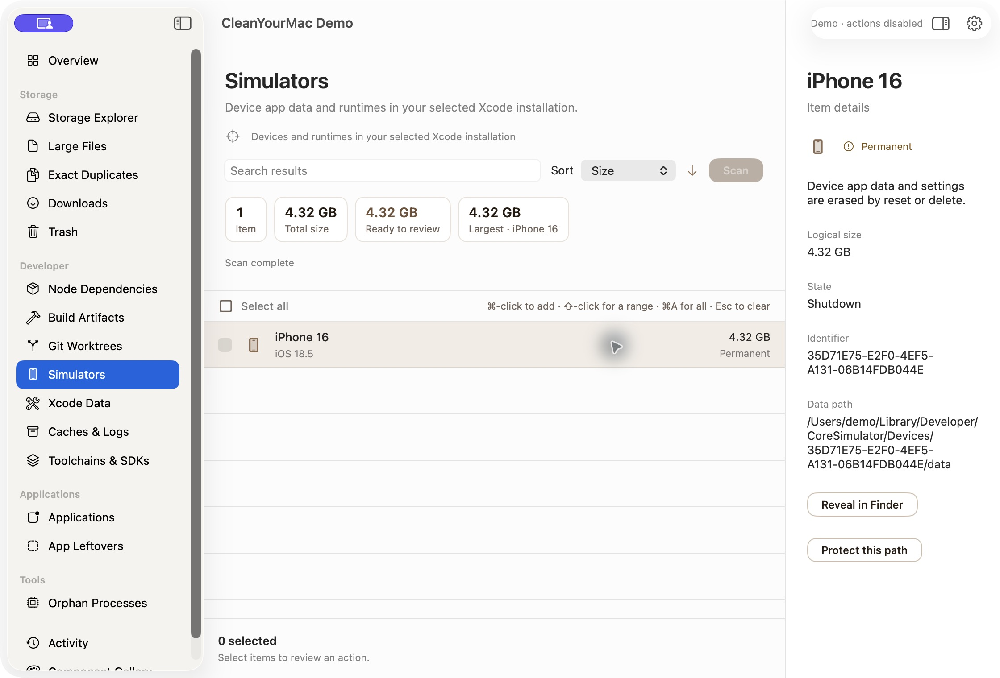
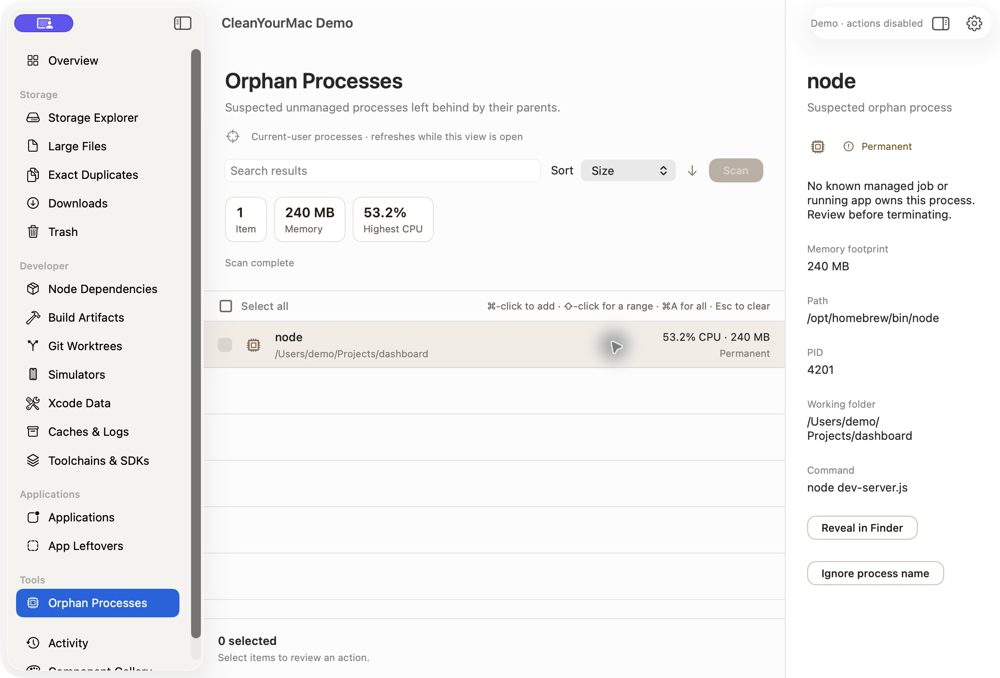

<p align="center"></p>

<h1 align="center">CleanYourMac</h1>

<p align="center"><strong>Find what uses space on your Mac. Remove only what you select.</strong></p>

<p align="center">Free and open source · Private · For macOS</p>

CleanYourMac finds items that use disk space on your Mac. Examples are large downloads, old project dependencies, Git worktrees and simulator data. The app shows what each item is. You select the items to remove.

**You control all changes.** The app does not select items for you. Before an action starts, you review the items and the result of the action. Your scan results and your files stay on your Mac.



*The screenshots show the real app with example data. Actions do not operate in the demo.*

## What the app finds

| Item type | What you can do |
| --- | --- |
| **Large files and downloads** | Sort by size. Search by name or path. Filter by size and age. |
| **Exact duplicates** | Find identical files. The app keeps one original of each file. The app does not search system, build or dependency folders. |
| **Project dependencies and build output** | See the projects that have large dependency folders (`node_modules`, Python environments, Pods, `vendor` and more) and generated files. The search stops at each dependency folder. |
| **Git worktrees** | See the branch, local changes, locks and size of each worktree. A badge shows registrations that have no folder. |
| **Simulators and Xcode data** | See simulator app data, DerivedData and device support. Xcode archives are protected. |
| **Toolchains, SDKs and caches** | Find installed language versions, SDK components, virtual devices, package caches and logs. |
| **Applications and possible leftovers** | See each application and its related files as separate items. The app shows when the owner of a file is not certain. |
| **Orphan processes** | See processes that their parent left running, with CPU and memory use. Then you can quit them. |

Select the folders to scan, or scan the whole Mac. Add exclusions for paths that you want to keep. Each tool keeps its own results. The totals below the search field show only the items that agree with your filters. The overview adds the results of all tools. It counts storage that two items share one time only.

## Install with Homebrew

The app needs macOS 14 or later. The preview operates on Mac computers with Apple silicon and with Intel processors.

```sh
brew tap scr2em/cleanyourmac https://github.com/scr2em/CleanYourMac
brew install --cask scr2em/cleanyourmac/cleanyourmac
```

Open **CleanYourMac** from the Applications folder. To update the app, do these commands:

```sh
brew update
brew upgrade --cask scr2em/cleanyourmac/cleanyourmac
```

You can also download the app from [GitHub Releases](https://github.com/scr2em/CleanYourMac/releases/tag/v0.1.0-preview.1). Unzip the file. Then move the app to the Applications folder.

**Preview release:** The app is not notarized by Apple at this time. macOS can ask for your approval when you open the app for the first time.

## How to use the app

1. **Select a tool and scan.** Select the folders to scan and the paths to exclude. Then start the scan.
2. **Examine the results.** Search by name or path. Sort by size. Click an item to see its details.
3. **Review before you remove.** Select the items. Read what the action will do. The app identifies permanent actions.

When you move an item to the Trash, you can restore it. The disk space becomes free when you empty the Trash. The Activity page keeps a local record of each action. From Activity, you can restore an item that is in the Trash and that has not changed.

### Search the results

Search the dependencies of your projects. See the totals and the project details on one page.



### Examine a simulator

See the device, runtime, state and app-data size before you reset or delete a simulator.



### Find processes that continue to run

See the CPU use, memory use, process identity and working folder before you quit a process.



## How each tool operates

**Scan** on the overview starts all tools except Exact Duplicates. Exact Duplicates reads the contents of all files, so it starts only when you open it. Results show while the scan continues. After the scan, the overview recommends these actions:
- Remove the dependencies and build output of projects that you did not use for 30 days or more.
- Remove caches that the tools make again when necessary.
- Remove Xcode build data.
- Remove duplicate copies, after you scan for duplicates.
- Empty the Trash.

### Rules for all tools

- **The app does not select items for you.** Immediately before an action, the app examines each item again. The item must be the same item, it must not have changed since the scan, it must be in the folders to scan, and it must not be excluded.
- **The app never shows these locations as items:**
  - system folders;
  - your home, Library, Documents and Desktop folders, and the Applications folders;
  - credentials, for example `~/.ssh`, `~/.aws`, `~/.gnupg` and Keychains;
  - iCloud Drive and other cloud folders;
  - all items in `.git` folders and all files with the name `.env`.

  The app shows an item but does not let you select it when it cannot read the full size. Put the pointer on a disabled item to see the reason.
- **The app shows what uses an item.** When an app or a tool uses an item, the app shows the process (name, PID and folder). You can then continue the action. You cannot skip checks that protect your data. For example, the app does not remove files that Git tracks or items that changed after the scan.
- **One failure does not stop the action.** When an item fails, the app continues with the other items. Then it shows how many items it changed and why the other items failed.
- **You can undo most actions.** You can restore an item that you moved to the Trash from Activity, if the item did not change. These actions are permanent: remove a worktree, reset or delete a simulator, empty the Trash and quit a process. The app identifies them.
- **Badges show the cost of an action.** *Rebuild* means that the item comes back automatically or with one command. *Review* means that you must examine the item first. *Permanent* means that you cannot undo the action.

<details>
<summary><strong>Storage Explorer</strong>: what uses space in a folder</summary>

Storage Explorer shows each item directly in the folders that you select. For each item, it shows the size on disk and the date of last use. You can move an item that is not protected to the Trash. Storage Explorer shows where space goes. It does not recommend items.
</details>

<details>
<summary><strong>Large Files</strong>: files of 100 MB or more</summary>

Large Files finds files of 100 MB or more in the folders that you select. Filter by size, age and last use. Then move the files that you do not need to the Trash.
</details>

<details>
<summary><strong>Exact Duplicates</strong>: identical files</summary>

Exact Duplicates compares files of 4 KB or more in three steps:
1. It compares the size.
2. It compares the first 64 KB.
3. It compares the full contents.

Hard links to one file count as one file. Each group keeps one original. The original is the first path in alphabetical order, and you cannot select it. Before the app moves a copy, it reads the copy and the original again. They must still be identical.

Exact Duplicates does not search version control, build output, dependency or package-cache folders. It is not part of the overview scan.
</details>

<details>
<summary><strong>Dependencies</strong>: installed packages, by project</summary>

Dependencies finds the installed packages of each project. The search stops at each dependency folder and does not search in it. The name of a folder is not sufficient. The project files that install the folder must also be present. Each item shows its project, the files that identify it and, if available, the official command of the tool. When a tool of the project runs (for example, a development server or a build), the app shows the item as in use.

Many ecosystems keep downloaded packages in one shared store that all projects use. Dependencies also shows these stores, with the label *Shared by all projects*. Caches & Logs shows the same stores. The totals count each store one time only.

| Ecosystem | In the project | Shared store |
| --- | --- | --- |
| Node.js (npm, pnpm, Yarn, Bun) | `node_modules` next to `package.json`. The lockfile identifies the package manager. | npm cache, Yarn caches, pnpm store, Bun cache |
| Deno | `node_modules` next to `deno.json` | Deno cache |
| Python | `.venv`, `venv` or `env` that contains `pyvenv.cfg`, in a project with `pyproject.toml`, `requirements.txt` or a similar file | pip, Poetry and conda package caches |
| Flutter / Dart | `ios/Pods`, `macos/Pods` | Pub hosted packages and Git packages |
| iOS and macOS | CocoaPods `Pods`, `Carthage/Build`, SwiftPM `.build/checkouts`, `repositories` and `artifacts` | CocoaPods, SwiftPM and Carthage caches |
| React Native, Capacitor | `ios/Pods`, `ios/App/Pods` | CocoaPods cache |
| Rust | `vendor` from `cargo vendor` | Cargo registry and Git checkouts |
| Go | `vendor` that contains `modules.txt` | Go module cache. The app only shows it, because Go makes it read-only. Use `go clean -modcache`. |
| Ruby | `vendor/bundle` | Bundler cache |
| PHP | Composer `vendor` | Composer cache |
| Java, Kotlin, Scala | None. Maven and Gradle keep no packages in the project. | Maven repository, Gradle caches, Ivy, Coursier |
| .NET | None | NuGet packages |
| Elixir | `deps` | Hex packages |
| Other | Terraform `.terraform`, Yarn `.yarn/unplugged`, Bower `bower_components`, renv `renv/library` | |

The app does not show Go, Cargo and Composer `vendor` folders that Git tracks, because they are part of the source of the project. The app does not search the folders that package managers and version managers keep for their own use. Examples are the pnpm store, the npm `_npx` folder and the global installations of nvm, fnm, Volta, asdf and mise.
</details>

<details>
<summary><strong>Build Artifacts</strong>: generated output, by project</summary>

Build Artifacts finds folders that a build makes. A project file must identify each folder:
- **JavaScript:** Next.js `.next`; Nuxt `.nuxt` and `.output`; SvelteKit, Angular, Docusaurus, Nx, Turborepo, Storybook, Parcel and coverage reports.
- **Mobile:** React Native, Expo, Capacitor and Flutter build folders.
- **Apple:** SwiftPM `.build` (without the downloaded packages) and `DerivedData` in a project.
- **Rust, JVM and native code:** Cargo `target`; Maven, sbt and Gradle; Zig; CMake build trees that contain `CMakeCache.txt`.
- **.NET:** `bin` and `obj`.
- **Game engines:** Unity and Unreal.
- **Python:** test and tool caches, `__pycache__` and `*.egg-info`.
- **Other languages:** Elixir `_build`, Haskell, Elm.

The next build makes all of these folders again. The exception is the Unreal `Saved` folder (autosaves and crash logs), which has the *Review* badge. You must close the IDE of the project before an action. The app does not remove folders that contain files that Git tracks. If the tool has its own clean command, each item shows it.
</details>

<details>
<summary><strong>Git Worktrees</strong>: linked worktrees and their state</summary>

Git Worktrees shows the linked worktrees of the repositories in the folders that you select. For each worktree, it shows the branch, size, last commit and local changes. To remove a worktree, the app uses `git worktree remove`. The branch stays.

The app does not remove a worktree when:
- the worktree is locked or prunable;
- the worktree has submodules;
- the worktree has uncommitted or untracked changes;
- the worktree is on a detached commit that no branch or tag contains.

The app shows the ignored files first, because the removal deletes them. A registration that has no folder has the *Orphaned* badge. The app only shows it and does not prune it.
</details>

<details>
<summary><strong>Simulators</strong>: devices and runtimes</summary>

Simulators reads the simulator list of Xcode. For each device, it shows the runtime, state, app-data size and the date of the last boot. You can reset or delete a device only when it is shut down. The app shows runtimes for information only. Use Xcode to manage runtimes.
</details>

<details>
<summary><strong>Xcode Data</strong>: DerivedData, device support and archives</summary>

Xcode Data shows each folder in DerivedData and iOS DeviceSupport. Xcode makes both again when necessary. For DerivedData, the app shows when Xcode last opened the folder.

Archives are protected. An archive can be the only copy of a build that you shipped. It also contains the debug symbols that you need to read its crash reports. You can move an archive to the Trash from its details, after you confirm that you accept this loss. The app does not move items while Xcode, `xcodebuild` or the Swift compiler runs.
</details>

<details>
<summary><strong>Caches & Logs</strong>: caches, logs and Mac leftovers</summary>

- **Developer caches:** JavaScript, Python, Apple, Flutter, JVM and Android, .NET, Rust, Go, PHP, Ruby, Elixir, Homebrew, JetBrains, VS Code and Unity. Each item shows the cost of its removal and the clean command of the tool.
- **`~/.cache`:** one item with the *Review* badge. It shows what the folder contains. It shows a warning when the folder contains a Hugging Face sign-in token.
- **`~/Library/Logs`:** the logs of each app, with the *Review* badge.
- **Mac leftovers:**
  - app caches, also of sandboxed apps;
  - saved window state;
  - Mail downloads;
  - iPhone and iPad software updates;
  - device backups, with the *Review* badge.

  The caches of Apple apps have the *Review* badge. You must close an app before the app moves its cache.
</details>

<details>
<summary><strong>Toolchains & SDKs</strong>: installed language versions</summary>

Toolchains & SDKs shows each installed version, with its size and the uninstall command of its manager:
- **Language version managers:** rustup, nvm, fnm, Volta, pyenv, rbenv and FVM.
- **Swift toolchains.**
- **Managers for many tools:** SDKMAN, asdf and mise.
- **Android:** system images, NDK, build tools and virtual devices.

You cannot select a version that is in use. A version is in use when it is the default or global version, when `.tool-versions` or a mise configuration pins it, or when an Android virtual device uses it. You cannot select a virtual device while its emulator runs.
</details>

<details>
<summary><strong>Applications</strong> and <strong>App Leftovers</strong></summary>

**Applications** shows the apps in `/Applications` and `~/Applications`. The caches, preferences, saved state and Application Support folder of each app are separate items. Thus you select exactly what to remove. Apple apps are protected. You cannot move an app or its files while the app runs.

**App Leftovers** shows caches, preferences and saved state in your Library that have the name of an app that is not installed. The app identifies the owner from the name only. Thus each leftover has the *Review* badge.
</details>

<details>
<summary><strong>Downloads</strong> and <strong>Trash</strong></summary>

**Downloads** shows each item in your Downloads folder, with the date that you last opened it. **Trash** shows the items in your Trash. When you empty the Trash, the removal is permanent.
</details>

<details>
<summary><strong>Orphan Processes</strong>: programs that continue to run</summary>

Orphan Processes shows your processes whose parent stopped. It does not show:
- processes that macOS manages (launchd jobs);
- apps and their helper processes;
- system processes;
- processes outside your folders, when you scan only the folders that you select.

Each item shows the CPU use, memory use, working folder and executable. **Quit** asks the process to stop. **Force Quit** becomes available only after Quit. Before each action, the app examines the identity of the process again.
</details>

## Appearance

The app has its own design, *Soft Studio*: rounded type, soft cards and pill-shaped controls. The default palette is White & Gray, with white surfaces on light gray and a graphite accent. In Settings, you can select a different palette: Paper & Walnut, Honey & Espresso, Ember, Terracotta & Navy, Cream & Mauve or Linen & Rose. Each palette has a light and a dark version. In Settings, select System, Light or Dark. System follows the setting of your Mac.

## License and contributions

CleanYourMac has the [MIT license](LICENSE). It does not need a subscription. It is an independent project and does not use MacPaw software or services. The orphan-process inspection uses parts of OrphanBar, an MIT-licensed project of the same owner. See [acknowledgments](THIRD_PARTY_NOTICES.md).

To report a problem or to suggest an idea, [open an issue](https://github.com/scr2em/CleanYourMac/issues).

To contribute, read the [development guide](docs/DEVELOPMENT.md), the [architecture](docs/ARCHITECTURE.md) and the [module guide](docs/MODULES.md).
