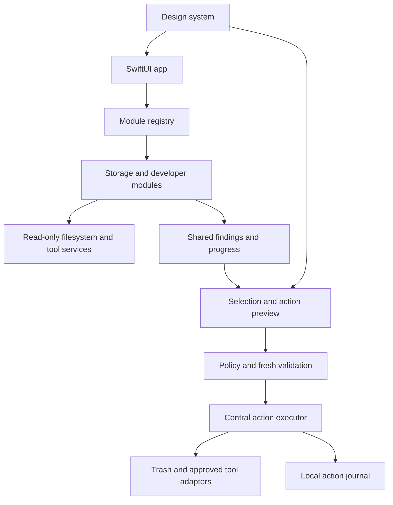

# CleanYourMac product and architecture plan

Product baseline and implementation record, 7 October 2026.

Build an open-source native macOS app in Swift that helps people understand storage use, remove selected clutter, and end orphaned processes. Git worktrees, Node dependencies, Xcode build data, simulator data, and orphan processes are first-class features. Each contributes through independently testable Swift modules. A self-contained SwiftUI design system governs tokens, components, layouts, and interaction states across all features.

The first local release now includes 14 finders, shared inspection/review, typed cleanup actions, a read-only CLI, a component gallery and optional orphan monitoring. This plan preserves the original comparison and staged roadmap. [README](../README.md) is the current feature list, [MODULES](MODULES.md) describes the implemented contracts, and [VERIFICATION](VERIFICATION.md) records validation and release limits.

## Agreed scope

Implement our own scanners, storage index, classification rules, action policies, adapters, and UI in Swift. Do not import, execute, wrap, download, or depend on the MacPaw CLI, CleanMyMac binaries, MacPaw code, or MacPaw services. Their public documentation is only a feature comparison reference. Official platform and developer-tool interfaces such as Foundation, Git, and Xcode may be used through our own adapters.

Protection, Cloud Cleanup, and Email Cleanup are excluded from this product and roadmap. That includes malware/antivirus, browser-history/privacy cleanup, third-party permission auditing, cloud-provider integrations, inbox cleanup, and newsletter unsubscribing. Local filesystem access prompts and cleanup safeguards remain necessary parts of the storage workflow.

CleanMyMac/MacPaw Performance is also excluded: no RAM boosting, DNS flushing, Spotlight/Mail reindexing, permission repair, periodic maintenance scripts, purgeable-space tricks, or Time Machine snapshot thinning. Orphan-process discovery and reviewed termination remain an independently requested feature based on our OrphanBar project.

Keep features extensible and the visual vocabulary governed centrally. Feature modules contribute data and actions; they use the same approved design-system components and layouts. See [the design system specification](DESIGN_SYSTEM.md).

## CleanMyMac feature inventory

This baseline covers the storage, application, and developer areas of the current CleanMyMac product family. Availability differs between direct distribution, Setapp, and the App Store. Use current capabilities as a reference, with an independent interface and implementation.

| Area | Current capabilities | Proposed coverage |
| --- | --- | --- |
| Smart Care | Combined scans across product modules. [Source](https://macpaw.com/support/cleanmymac/knowledgebase/smart-care) | Overview composed from our enabled storage/application modules; scanning and applying actions remain separate. |
| Cleanup | User/system caches and logs, Xcode junk, iOS device backups, mail attachments, local/external/mail Trash. Additional categories include broken preferences/login items, deleted users, document versions, language files, and universal binaries. [Source](https://macpaw.com/support/cleanmymac/knowledgebase/missing-features) | Documented user cache rules and developer artifacts. Backups need a future dedicated workflow. Mail is excluded. Bundle modification and deleted-user cleanup are outside the roadmap. |
| Applications | Uninstaller, related-file leftovers, installer cleanup, and app updates, including edition-dependent update channels. [Source](https://macpaw.com/support/cleanmymac/knowledgebase/missing-features) | Installed-app inventory, then reviewed uninstallation and leftovers. Updates follow with provider-specific support. |
| My Clutter | Large/old files, duplicates, similar images, Downloads, and AI caches/logs/local models. [Source](https://macpaw.com/support/cleanmymac/knowledgebase/my-tools) | Large-file finder first; exact duplicates and developer/AI storage later. User models are explicitly selected assets. |
| Space Lens | Disk, external-volume, and folder storage visualization. [Source](https://macpaw.com/support/cleanmymac/knowledgebase/space-lens) | Shared size index with a sortable folder tree; treemap later. |
| My Tools and activity | Searchable/favorite tools, recommendations, health/activity statistics, screen cleaning mode. [Tools](https://macpaw.com/support/cleanmymac/knowledgebase/my-tools), [activity](https://macpaw.com/support/cleanmymac/knowledgebase/missing-features) | Search and module toggles first; local action history. Favorites and screen cleaning are later conveniences. |
| Menu monitoring | Storage and other status summaries. [Source](https://macpaw.com/support/cleanmymac/knowledgebase/missing-features) | Optional menu-bar storage and orphan-process summary, using our own modules. |

## Developer modules

Discovery is available before destructive actions. An unavailable integration produces a useful status and explanation; it never falls back to deleting a similarly named folder.

| Module | What the app should find and show | Action scope |
| --- | --- | --- |
| Git worktrees | Repository, main/linked worktree, path, branch or detached HEAD, size, locked/missing state, tracked changes, untracked and ignored files, local commit/upstream status. | First release: discovery, reveal, protect, and generated-artifact cleanup inside selected trees. Later: reviewed removal of eligible linked trees and a separate preview for stale metadata pruning. |
| iOS simulators | Devices grouped by platform/runtime, boot state, availability, per-device data size, runtime inventory, and known simulator caches. | First release: discovery. Next release: reset/delete a specifically selected shutdown device through a verified adapter. Runtime management remains a separate workflow. |
| Node projects | node_modules under chosen roots, owning package.json, lockfile/package manager, repository/worktree, apparent project activity, and logical/allocated size. Support monorepos and nested projects. | Reviewed movement of eligible dependency directories to Trash. Preserve manifests, locks, patches, and source files. Display the package manager's reinstall guidance; never run project install scripts automatically. |
| Xcode artifacts | DerivedData, module/build caches, simulator caches, device support, downloaded components, and archives as distinct categories. | Selected reproducible build/cache data first. Archives, dSYMs, physical-device backups, and simulator app data remain explicitly reviewed assets. |
| JavaScript build artifacts | .next, .nuxt, .turbo, .parcel-cache, coverage, and configured dist/build outputs with project evidence. | Reviewed cleanup through named rules. A directory named build or dist alone is insufficient evidence. |
| Package caches | npm, pnpm, Yarn, Bun, Homebrew, SwiftPM, CocoaPods, pip/uv/Poetry, Cargo, Go, Gradle, and Maven. | Add individual adapters in stages. Shared stores use tool-aware workflows, distinct from deleting project dependencies. |
| Other language artifacts | Swift .build, Rust target, Python __pycache__ and environments, Java/Android outputs, Go build caches. | Reproducible outputs first; environments and vendored dependencies need additional project evidence and review. |
| Containers and VMs | Docker/Podman/Colima images, containers, build caches, volumes, and virtual disk allocation. | Inventory first; supported per-object cleanup later. Volumes are user data and require separate treatment. Never delete a virtual disk as a cache shortcut. |
| AI storage | Ollama/LM Studio/Hugging Face models and downloads, inference/tool caches and logs. | Caches and model removal are separate. Preserve conversations, credentials, custom models, and training data. |
| IDE data | Known VS Code and JetBrains caches, logs, and old downloads. | Preserve settings, extensions, local history, and unsaved recovery data. |
| Orphan processes | Current-user orphan candidates, CPU rate, memory footprint, PID, uptime, executable/command, and working folder. Exclude managed services, OS components, active apps/helpers, and ignored names. | First release: reviewed SIGTERM, followed by an explicit force-quit option for a process still running. Batch termination uses a fixed reviewed selection. Optional monitoring never terminates automatically. |

### Orphan process behavior

Use our existing [OrphanBar scanner](/Users/mohamed/projects/orphan-bar/Sources/OrphanBar/ProcessScanner.swift) and [monitor](/Users/mohamed/projects/orphan-bar/Sources/OrphanBar/OrphanMonitor.swift) as the behavioral reference, adapting the implementation into our own module and platform services rather than invoking its executable. Preserve the MIT attribution for code carried over.

Candidates are current-user processes reparented to launchd that are not known managed jobs, OS components, apps, XPC services, extensions, or helpers of running apps. Parent PID 1 alone is insufficient evidence. If managed-job inspection fails, mark the scan incomplete and disable termination of uncertain candidates. Preserve default exclusions for ssh-agent, gpg-agent, keyboxd, and dirmngr; support persistent per-name and executable exclusions.

Show CPU rate across samples, memory footprint, PID, start time/uptime, command, working folder, and the reason a process was classified. Treat candidates as suspected orphans, because intentionally detached daemons may satisfy the heuristic. Keep process resource usage separate from disk reclaim estimates. Copy PID/command, reveal the working folder, and ignore are explicit actions; avoid persisting sensitive command arguments.

Terminate selected processes with SIGTERM first. Track signal delivery separately from observed exit. After two seconds, offer an explicit Force Quit action using SIGKILL; never escalate automatically. Revalidate ownership, start time including subsecond precision, executable, exclusions, and classification before every signal. PID reuse or a changed classification skips the action. Check actual process existence to determine exit, rather than treating disappearance from the candidate list as successful termination.

Adapt refresh behavior from OrphanBar: two-second updates while the view is visible and ten-second updates only when the optional background/menu-bar monitor is enabled. Run inspection off the UI thread, with bounded tool output/timeouts. Cancellation stops scans; it cannot undo a delivered signal. Process termination has no restore guarantee and does not delete an executable or working folder.

Extend Core with typed file/process identities and resource-specific metrics, plus ProcessReader, ManagedJobInspector, and SignalSender service boundaries. The Orphan Processes page uses the shared finder, inspector, badges, review, and history components. Include classification failures, managed jobs, running helpers, ignored agents, cross-user processes, recycled PIDs, delayed exit, reclassification, permission errors, and partial batch outcomes in tests.

### Git worktree behavior

Find repositories inside user-selected roots, including .git directories, .git files, and bare repositories. Query Git for its registered worktrees using stable, NUL-delimited porcelain output. Group by the canonical common repository directory so shared Git objects are not counted once per worktree. Registered paths outside the scan roots may be listed, but require an explicitly added root before traversal or action.

Use modification and commit dates as activity signals, not proof that a tree is disposable. Protect main, locked, dirty, untracked, unknown-status, and potentially valuable ignored content. Surface commits without a verified upstream and detached commits; do not infer that a clean working directory means its commits exist elsewhere.

Later removal uses Git's worktree command without force. Immediately repeat eligibility checks and let Git reject unsafe states. Inspect ignored content as well: ignored .env files and local assets can still matter. Trees with submodules or nested repositories remain discovery-only until specifically supported. Removal is not presented as undoable unless a complete, tested backup-and-restore workflow exists. Pruning missing-worktree metadata is a different action from removing a directory. [Git worktree reference](https://git-scm.com/docs/git-worktree)

### Simulator behavior

Distinguish runtime installations, simulated devices, device app data, and disposable caches. Inventory through the selected Xcode installation and its simctl capabilities. Device reset loses app data and settings; device deletion and runtime removal have different consequences and recovery paths.

Require selection by device identifier, a shutdown state, and a fresh check before a device action. Never automatically shut down a device to clean it. Do not use an erase-all or delete-all operation in a cleanup preset. For runtime removal, begin with guidance to Xcode's supported component manager; add a direct adapter only after validating the relevant Xcode versions. Apple documents separate runtime and device management flows. [Apple simulator management](https://developer.apple.com/documentation/safari-developer-tools/adding-additional-simulators)

### Node dependency behavior

Stop discovery descent when an artifact root is recognized; size its contents without treating every nested dependency as another project. Do not follow symlinks into workspaces or global stores. Attribute linked/shared content separately and deduplicate overlapping roots and findings.

Label node_modules as reinstallable only when the project evidence supports that conclusion. Detect tracked/vendor content and flag local edits or ambiguous ownership for inspection. A lockfile alone does not guarantee that a locally patched dependency can be recovered. npm/pnpm/Yarn caches and content-addressable stores need their own adapters; npm describes its cache as self-healing, so cache deletion should be a space decision rather than a routine repair claim. [npm cache reference](https://docs.npmjs.com/cli/v11/commands/npm-cache/)

## Swift architecture

Proposed baseline: macOS 14+, Swift 6 language mode, SwiftUI, Observation, and structured concurrency. Use AppKit for Finder integration, native panels, Trash operations, and other desktop behaviors where needed. Ship a native .app target with local Swift Package Manager packages and plan universal Apple silicon/Intel releases, with both architectures verified before claiming support.

The implementation uses an Observation app store, streamed scan events, async effects, and injected platform services. Composability means independently registered ScanModule types and reusable services. No third-party state framework is required.

```text
CleanYourMac/
  App/                         Native app target and composition root
  Packages/
    CleanYourMacCore/           Contracts, findings, plans, orchestration
    CleanYourMacPlatform/       Filesystem, Git, Xcode and tool adapters
    CleanYourMacDesignSystem/   Governed tokens, components and layouts
    CleanYourMacUI/             Shared results, review and detail views
    CleanYourMacModules/        One target per feature module
  CLI/                         Later frontend using the same core
  Tests/Fixtures/               Synthetic disks, repos and tool responses
  docs/                        Plan, module guide and architecture decisions
```

Dependency direction is UI and modules toward Core. Platform implements Core service protocols. DesignSystem depends on native UI frameworks and has no dependency on Core or feature modules. UI depends on Core and DesignSystem. The app composition root registers modules and provides their dependencies. Core does not import SwiftUI or depend on specific modules. Specialized detail views live in reviewed UI adapters assembled from the design system; common findings use shared views.



The implemented scanner contract:

```swift
public protocol ScanModule: Sendable {
    var descriptor: ModuleDescriptor { get }

    func scan(in context: ScanContext)
        -> AsyncThrowingStream<ScanEvent, Error>
}
```

Modules use discovery services and produce findings. The immutable ActionRequest snapshots the reviewed selection and action kind; current scope and exclusions are supplied again when applying it. The common action executor owns mutations. Typed operations such as trash-item, delete-simulator-device, or remove-Git-worktree refer to approved adapters. Modules cannot submit arbitrary shell strings.

Core contracts:

- ModuleDescriptor: stable ID, category, version, capabilities, required tools/permissions, settings schema, and supported action kinds.
- ScanContext: chosen roots, exclusions, injected readers, tool capabilities, and scan cancellation.
- Finding: resource identity, owner/project, reason, evidence, completeness, size estimate, risk, and available actions. Findings are not automatically cleanup candidates.
- ScanEvent: incremental findings, progress, skipped paths, warnings, and completion.
- ActionPlan: selected resource identities, operation kinds, expected state, preconditions, consequences, recovery policy, and size estimate.
- ActionResult: per-item applied/skipped/failed status, reason, actual Trash destination where available, and journal entry.

One coordinator runs bounded concurrent scans. Filesystem services reuse enumeration and sizing results, while a normalizer eliminates overlapping selections and duplicate resource counts. Cancellation stops new work and leaves the review screen usable. Slow tools have timeouts; missing permissions and unavailable services appear as partial coverage, never as zero findings.

### Adding a feature

Add a module target implementing the contract, declare capabilities/settings, register it in the composition root, and provide discovery/action fixtures. The shared UI automatically exposes its category, findings, progress, selection, and review. A specialized inspector is optional and uses existing design-system components through a reviewed UI adapter. Modules cannot inject arbitrary UI or introduce local styling tokens.

Start with trusted modules compiled into the app. A reviewed declarative rule format can later support simple cache finders without new Swift code, with bounded roots and no executable scripts. Downloaded binary plugins require a separate signing, compatibility, and isolation design; in-process protocols alone do not sandbox third-party code.

## Review and action rules

The default journey is choose roots, scan, inspect findings, select items, review consequences, apply, and inspect results. The sidebar should offer Overview, Storage, Developer, Applications, Tools, and Activity. Developer groups include repositories/worktrees, Node projects, Xcode/simulators, and tool caches. Selection and explanations are shared across views.

- No cleanup runs during scanning or automatically in the background. First release findings begin unselected.
- Show exact paths, ownership, evidence, confidence, size, why an item was found, and what will be lost or rebuilt.
- Persist protected paths/projects and module exclusions. Never recommend credentials, keychains, source files, .git metadata, or broad Library/Application Support directories as generic junk.
- Exclude File Provider and cloud-synced roots from default cleanup scope. Remote storage and sync-aware deletion are outside this product's supported actions.
- Validate resource identity, ancestry, exclusions, owner state, and action preconditions immediately before applying. Reject changed or symlink-swapped targets; destructive filesystem operations need race-aware traversal rather than only an earlier path-string check.
- Use native Trash for eligible file actions and record its returned destination. Restore is best-effort while the item exists and its original location is free. Tool actions explicitly state their own recovery limits. [Foundation Trash API](https://developer.apple.com/documentation/foundation/filemanager/trashitem(at:resultingitemurl:))
- Moving to Trash does not immediately free storage on that volume. Report bytes moved separately from measured free-space change; emptying Trash is a distinct permanent action.
- Distinguish logical size, allocated size, and uncertain reclaim estimates. Hard links, sparse files, APFS clones/snapshots, and shared stores can make size totals misleading; avoid a guaranteed freed-space promise.
- Skip active builds and running owners where detectable. Ambiguous ownership or activity requires inspection. Simulator and Git adapters repeat their specific checks.
- Run approved executables with argument arrays, bounded output, controlled environments, and cancellation. No shell interpolation or automatic execution of repository scripts.
- Scans stay local. Keep logs and history local, minimize sensitive filenames, and redact exports by default. Optional app-update checks later use explicit provider adapters and do not upload scan contents.
- Begin without a privileged helper. Explain missing access per feature and ask for folder access or Full Disk Access only when needed. Full Disk Access and administrator privileges are separate capabilities.

Proposed distribution is a signed and notarized direct download, with an optional Homebrew cask after releases are stable. An App Store build can be assessed later with a narrower capability set. Proposed license is MIT; source, rule definitions, fixtures, and contribution guidance should be public when the project is published.

## Delivery milestones

Milestones are dependency-ordered release scopes, not calendar estimates.

| Milestone | Deliverable | Completion condition |
| --- | --- | --- |
| Foundation | App shell, design-system tokens/component gallery, Core contracts, registry, injected services, synthetic fixture module, scan cancellation, exclusions, shared findings/review UI, local journal, and filesystem action policy. | Design-system states pass visual/accessibility review; a fixture module appears without editing the shared results screen; discovery makes no mutations; a changed or excluded target is rejected. |
| v0.1 Developer tools | Selected-root folder sizes, large-file inventory, worktree finder, simulator/device-data inventory, Node finder, DerivedData discovery, orphan-process discovery and reviewed termination, and reviewed Trash actions for eligible Node/DerivedData findings. | All requested developer finders work through the same pipeline; process and file metrics remain distinct; errors and partial coverage are visible. |
| v0.2 Developer cleanup | Selected simulator-device actions, eligible linked-worktree removal, JS build rules, Swift/Rust/Python artifacts, and individually verified package-cache adapters. | Git and simulator actions pass their eligibility matrix; no forced removal or global erase operation; each module documents recovery and rebuild consequences. |
| v0.3 General Mac tools | App inventory and related-file review, conservative uninstall/leftovers, known user caches/logs, Downloads, reviewed Trash emptying, exact duplicate detection, and improved storage visualization. | Shared app containers and running apps are handled explicitly; duplicates use content verification and preserve at least one selected original; no partial scan claims completeness. |
| Later integrations | Optional storage/orphan menu bar, our own CLI/JSON output, Docker/VM and AI adapters, similar images, and update providers. | Each integration has independent fixtures, permission handling, clear consequences, and platform/version validation. |

The initial workspace release incorporates the Foundation, developer tools, developer cleanup and conservative general Mac tools described above. Menu-bar monitoring and the read-only CLI are also implemented. Docker/VM, AI, similar-image and update-provider integrations remain deferred. Module types currently share one SwiftPM target rather than a target per feature; the package boundaries and scanner protocol remain separable.

## Verification and release criteria

Use Swift Testing for Core/module logic with injected filesystems, clocks, process runners, and capability responses. Integration tests create temporary projects and Git repositories; they never operate on real developer folders. Simulator tests use recorded responses, with a dedicated disposable device for explicitly enabled live tests.

Cover repository .git files, bare repositories, locked/main/detached/dirty trees, untracked and ignored files, no upstream, missing mounts, nested repos, unusual path characters, and tool failure. Cover monorepos, symlinked dependencies, shared/hard-linked content, overlapping findings, tracked dependencies, and ambiguous project ownership. Cover booted, shutdown, unavailable, and missing simulator states across supported Xcode versions.

Exercise permission denial, stale plans, symlink/path replacement, cancellation, partial tool failures, conflicting selections, journal interruption, Trash restore conflicts, and large directories. Verify that a discovery scan does not mutate its target filesystem; some developer tools may independently create their own service logs. Check responsiveness and bounded memory with a large synthetic tree rather than promising an unmeasured scan speed.

Build/test shared packages in CI and compile the app for supported deployment targets. Validate the component/state gallery and representative user flows, keyboard access, VoiceOver labels, light/dark mode, increased contrast, reduced transparency, and reduced motion. Enforce central tokens and component reuse during review and CI. Before public binaries, validate both architectures, signing/notarization, tool compatibility, and clean-install permissions. Include a module authoring guide, contribution guide, and security reporting process.

## Current workspace and next decision

The workspace began empty. Local Xcode and Swift 6.3.3 are present. The app compiles for macOS 14 in Swift 6 mode and builds as a universal bundle. Simulator services were inaccessible during restricted planning, then verified through live read-only inventory and reset/delete of a newly generated disposable device. Native Trash/restore and owned orphan-process signal tests also passed.

The implemented baseline is macOS 14+, SwiftUI, MIT, independent compiled Swift modules, a governed design system, and the developer tools above. Public repository publication, Developer ID signing, notarization and external distribution have not been performed.
